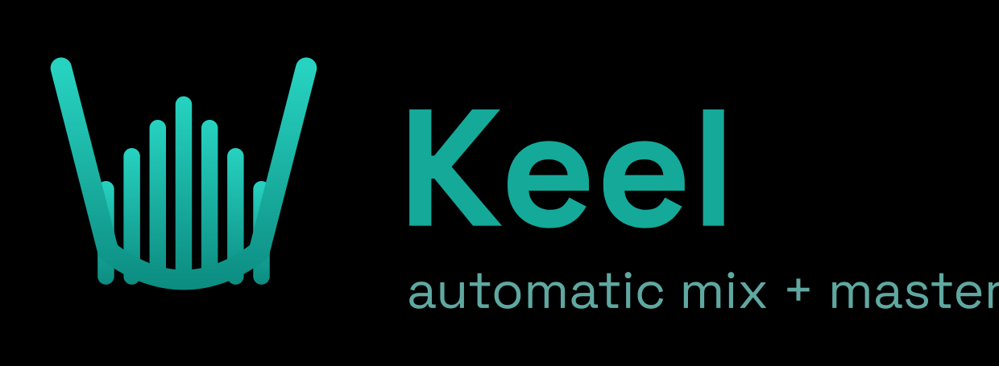

<p align="center"><a href="README.md">English</a> · <b>Español</b></p>

<p align="center">
  
</p>

<p align="center">
  <a href="https://github.com/fcarvajalbrown/Keel/releases/download/v0.1.0-alpha/KeelSetup-0.1.0.exe">
    
  </a>
</p>
<p align="center"><sub>Alpha sin firmar: Windows puede advertir — haz clic en <b>Más información &rarr; Ejecutar de todas formas</b>. macOS y otras descargas en la <a href="https://github.com/fcarvajalbrown/Keel/releases/latest">página de releases</a>.</sub></p>

> Un motor **determinista** de mezcla y masterización automática. Le das una
> carpeta de **stems ya terminados, con sus efectos impresos**; los
> **balancea por volumen percibido** en una mezcla estéreo y masteriza esa
> mezcla a un **loudness seguro para streaming** — sobre la medición
> **ITU-R BS.1770-4** y una cadena de máster con **limitador de true peak**.
> Los mismos stems entran, el mismo máster sale, siempre. Sin adivinanzas de
> IA, sin aleatoriedad.

<div align="center">

[](ROADMAP.md)
[](LICENSE)
[](LICENSE-GUI.md)
[](COMMERCIAL-LICENSE.md)
[](requirements.txt)
[](#bajo-el-capó-el-dsp)
[](#)

</div>

<p align="center">
  <a href="https://www.paypal.com/donate/?business=fcarvajalbrown%40protonmail.com&item_name=Support%20Keel%20development&currency_code=USD">
    
  </a>
</p>

**Qué hace, en una línea:** convierte un montón de stems terminados en una
mezcla balanceada y un máster competitivo y seguro de picos, con un solo
comando — sin tocar tu tono.

Keel es para dos personas. El **productor** con buenos stems que no quiere (o no
puede) mezclar y masterizar a mano: un comando, listo. El **ingeniero** que
quiere una etapa de balance+máster determinista y scriptable dentro de un
pipeline: objetivos de LUFS exactos, un medidor real de true peak sobremuestreado,
reproducible a la muestra, con un reporte de control de calidad en cada corrida.
La meta a largo plazo es una **GUI de escritorio** y un **VST/plugin** sobre el
mismo motor — ver [`ROADMAP.md`](ROADMAP.md).

> Palabras clave: mezcla automática, masterización automática, normalización de
> loudness, LUFS, true peak, ITU-R BS.1770-4, balance de stems, limitador,
> cadena de máster, audio determinista, reproducible, audio en Python,
> VST (planeado).

---

## De un vistazo

| | |
|---|---|
| **Entrada** | Cualquier número de stems terminados, con efectos impresos (`.wav` / `.flac`) |
| **Salida** | **Mezcla** estéreo balanceada + **máster** seguro de loudness (WAV 24-bit) + `REPORT.md` |
| **Loudness** | Normalizado a un **objetivo LUFS exacto** (por defecto **-14**), ITU-R BS.1770-4 |
| **Picos** | Limitación real de **true peak sobremuestreado 4x** a un techo dBTP (por defecto **-1.0**) |
| **Etiquetado** | **Autodetectado**, editable en `keel.json`; **1..N archivos por etiqueta** |
| **Masterización** | Cadena interna clip -> limit, **o** igualar una referencia comercial (Matchering) |
| **Determinismo** | Mismas entradas -> salida **idéntica**. Sin ML, sin aleatoriedad en el render |
| **Tono** | **Intacto** — Keel balancea y masteriza; nunca re-ecualiza tus stems |

---

## Cómo funciona (la cadena de señal)

```
MEZCLA  stems -> [agrupar por etiqueta] -> [balancear loudness por grupo] -> [pan?] -> sumar -> mix.wav
MÁSTER  mezcla -> [tono/glue] -> [pre-normalizar] -> [soft-clip sobremuestreado]
               -> [limitador true peak 4x] -> [normalizar a LUFS exacto] -> [seguro TP] -> master.wav
```

Cada paso está guiado por medición y es determinista. La mezcla deja el bus
cerca de -6 dBFS para que el máster tenga espacio; el máster normaliza a tu
objetivo LUFS exacto y garantiza el techo de true peak.

---

## Instalación

Recomendado — un entorno virtual local (mantiene aisladas las dependencias de
Keel, corre igual en cualquier máquina). `setup.ps1` crea `.venv` e instala el
motor central **sin conexión** desde los wheels incluidos:

```powershell
.\setup.ps1                 # crea .venv + instala el motor offline desde vendor/
.\setup.ps1 -Online         # ...o desde PyPI
.\setup.ps1 -Matchering     # también instala el camino opcional de máster por referencia
.\.venv\Scripts\Activate.ps1   # activa, luego corre build.py
```

El `.venv` nunca se commitea — se reconstruye desde `requirements.txt` /
`vendor/` en cada máquina.

---

## Inicio rápido

**1. Pon tus stems en una carpeta** — cualquier cantidad, cualquier nombre. Keel
no exige un set fijo de stems; autodetecta una etiqueta por archivo, y la
corriges después.

**2. Córrelo:**
```powershell
python build.py --stems "C:\ruta\a\mi_cancion" --out out
```
En la primera corrida Keel escribe **`mi_cancion/keel.json`** (mapa autodetectado
archivo -> etiqueta + balance por etiqueta) y renderiza `out/mi_cancion_mix.wav`,
`out/mi_cancion_master.wav` y `out/REPORT.md`.

**3. Corrige las etiquetas y vuelve a correr.** La autodetección es solo una
suposición. Abre `keel.json`, reasigna cualquier archivo a la etiqueta correcta
(**una etiqueta puede tener 1 o 10 archivos** — se balancean como un grupo),
ajusta el balance por etiqueta, y corre el mismo comando otra vez.

### Más formas de correrlo

```powershell
python build.py --stems ./mi_cancion --scan                  # solo (re)escribe keel.json, sin render
python build.py --stems ./mi_cancion --preset loud           # perfil de loudness "house sound"
python build.py --list-presets                               # lista los presets con nombre
python build.py --stems ./mi_cancion --lufs -11 --tp -1      # más fuerte, fija el techo TP
python build.py --stems ./mi_cancion --ref "C:\refs\ref.wav" # igualar una referencia (Matchering)
python build.py --stems ./mi_cancion --mix-only              # detente tras la mezcla
python build.py --stems ./mi_cancion --master-only           # remasteriza una mezcla existente
python build.py --batch "C:\ruta\al\album" --out out         # cada subcarpeta (su propio keel.json)
```

---

## Bajo el capó (el DSP)

- **Loudness:** LUFS integrado vía `pyloudnorm` (ITU-R BS.1770-4, gated a 400 ms).
- **True peak:** un medidor real de sobremuestreo **FIR polifásico 4x** (scipy
  `resample_poly`, Kaiser beta 12) — atrapa picos inter-muestra que un medidor de
  pico de muestra pierde (hasta ~+3 dB).
- **Cadena de máster:** tono (HPF 28 / low-shelf / aire / glue suave) ->
  pre-normalizar -> **soft-clip tanh sobremuestreado** (redondea los transientes
  más filudos) -> **limitador de true peak sobremuestreado 4x** -> normalizar al
  objetivo exacto -> seguro de true peak. El par clip-luego-limita es el enfoque
  fuerte-pero-limpio: el clipper toma la punta para que el limitador quede limpio.
- **Máster por referencia (opcional):** `matchering` iguala el espectro, loudness
  y ancho estéreo de una referencia comercial; la referencia fija el loudness.
- **Por defecto:** máster **-14.0 LUFS / -1.0 dBTP** (óptimo para streaming);
  ancla interna por stem **-20 LUFS**. La cadena llega a -10/-11 limpio si se pide.

Cada corrida de `build.py` escribe `out/REPORT.md`: balance por etiqueta
(LUFS pre/post + ganancia) y el LUFS/dBTP final del máster vs. objetivo — un
vistazo para confirmar que aterrizó.

---

## Hacia dónde va Keel

Hoy Keel es una herramienta de línea de comandos. La misión es llegar a
cualquier músico sobre el mismo motor determinista:

1. **GUI de escritorio** — arrastra una carpeta de stems, ve las etiquetas y los
   medidores de loudness, obtén tu mezcla + máster.
2. **VST / plugin** — corre la etapa de balance + máster de Keel dentro de tu DAW.

El núcleo DSP está hecho y validado. Ver [`ROADMAP.md`](ROADMAP.md) para el plan
y [`docs/adr/`](docs/adr/) para los registros de decisión (por qué el motor, la
configuración, el toolkit, la licencia y el empaquetado son como son).

---

## Apoya / Dona

Keel es gratis para la gente para la que está hecho, y sigue vivo gracias a las
donaciones. Si te ahorró un cobro de mezcla y máster o una suscripción mensual,
puedes aportar:

- **PayPal:** [Donar](https://www.paypal.com/donate/?business=fcarvajalbrown%40protonmail.com&item_name=Support%20Keel%20development&currency_code=USD)
  (o envía a `fcarvajalbrown@protonmail.com`)
- O usa el botón **Sponsor** arriba en el repo de GitHub.

Las donaciones son voluntarias y financian el desarrollo; no son una compra y no
otorgan derechos comerciales.

## Licencia

Keel se licencia en dos partes.

- **El motor** (librería Python + CLI) es **GNU AGPL-3.0** ([`LICENSE`](LICENSE)) —
  libre y de código abierto. Copyleft: si lo distribuyes o corres una versión
  modificada como servicio de red, debes liberar tu código bajo la AGPL también.
- **La GUI de escritorio** (la app `Keel.exe` / `Keel.app`) es **gratis para uso
  no comercial** y **gratis para músicos que hacen su propia música** — aunque la
  vendas — bajo la PolyForm Noncommercial License más una concesión adicional
  ([`LICENSE-GUI.md`](LICENSE-GUI.md)).

Una **licencia comercial** ([`COMMERCIAL-LICENSE.md`](COMMERCIAL-LICENSE.md)) —
**USD 20, pago único, por asiento** — solo se requiere para uso
**comercial / de redistribución**: ofrecer Keel como producto o servicio de pago,
usar la GUI para trabajo de clientes en un estudio/agencia, redistribuirla dentro
de otro producto, o integrar el motor en un producto de código cerrado sin el
copyleft de la AGPL.

En una línea: **haz tu propia música con él gratis; paga solo si montas un
negocio sobre él.**

## Autor

Felipe Carvajal Brown — fcarvajalbrown@gmail.com

Copyright (C) 2026 Felipe Carvajal Brown.
